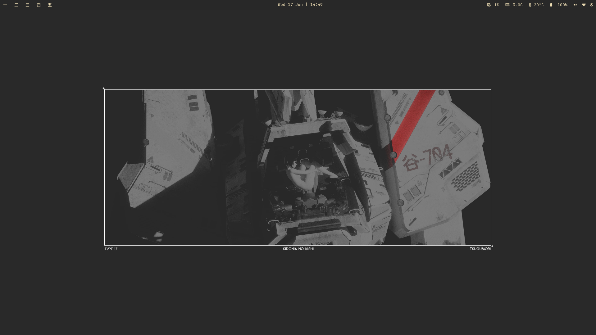

# dotfiles



Gruvbox Dark Hard rice for Fedora Sway Spin.
Managed with [GNU Stow](https://www.gnu.org/software/stow/).

---

## What's in here

| Package | Installs to |
|---|---|
| `sway` | `~/.config/sway/config` |
| `waybar` | `~/.config/waybar/` |
| `kitty` | `~/.config/kitty/kitty.conf` |
| `rofi` | `~/.config/rofi/` |
| `dunst` | `~/.config/dunst/dunstrc` |
| `flameshot` | `~/.config/flameshot/flameshot.ini` |
| `nvim` | `~/.config/nvim/` |
| `tmux` | `~/.config/tmux/tmux.conf` |
| `lazygit` | `~/.config/lazygit/config.yml` |
| `fastfetch` | `~/.config/fastfetch/` |
| `wallpaper` | `~/.config/sway/wallpaper.jpg` |

GTK theming is **not** stowed — see [Theming gotchas](#theming-gotchas) below,
it needs a few manual steps rather than a config file.

---

## Fresh machine setup

### 1. Base packages

```bash
sudo dnf install sway waybar rofi dunst swayidle swaylock kitty \
    flameshot neovim tmux lazygit gcc fastfetch \
    blueman pavucontrol wl-clipboard polkit-gnome \
    lxappearance
```

### 2. JetBrains Mono Nerd Font

The Fedora package doesn't include the Nerd Font icon glyphs. Grab them
straight from upstream:

```bash
mkdir -p ~/.local/share/fonts
cd /tmp
wget https://github.com/ryanoasis/nerd-fonts/releases/latest/download/JetBrainsMono.tar.xz
tar -xf JetBrainsMono.tar.xz -C ~/.local/share/fonts/
fc-cache -fv
```

### 3. Clone this repo and stow everything

```bash
git clone https://github.com/PsionicAlch/dotfiles.git
cd dotfiles
stow -t ~ sway waybar kitty rofi dunst flameshot nvim tmux lazygit fastfetch wallpaper
```

If Stow complains about a conflict, it means a real file already exists
at that path (not a symlink) — back it up or delete it, then re-run stow.

### 4. GTK theme, icons, cursor

These are third-party assets required to make the 

```bash
# GTK theme — Gruvbox-Dark-Hard
sudo dnf install sassc gtk-murrine-engine
git clone https://github.com/Fausto-Korpsvart/Gruvbox-GTK-Theme.git /tmp/gruvbox-gtk
cd /tmp/gruvbox-gtk/themes
./install.sh -d ~/.themes -c dark --tweaks black -l

# Icons — GruvboxPlus (extracts as Gruvbox-Plus-Dark / Gruvbox-Plus-Light)
git clone https://github.com/SylEleuth/gruvbox-plus-icon-pack.git /tmp/gruvbox-icons
mkdir -p ~/.local/share/icons
cp -r /tmp/gruvbox-icons/Gruvbox-Plus-Dark ~/.local/share/icons/
gtk-update-icon-cache -f -t ~/.local/share/icons/Gruvbox-Plus-Dark

# Cursor — Capitaine Cursors (Gruvbox variant)
cd /tmp
wget https://github.com/sainnhe/capitaine-cursors/releases/latest/download/Linux.zip
unzip Linux.zip
cp -r "Capitaine Cursors (Gruvbox)" ~/.local/share/icons/
```

Original sources, for attribution / re-checking for updates:
- Theme: https://github.com/Fausto-Korpsvart/Gruvbox-GTK-Theme (also on [gnome-look](https://www.gnome-look.org/p/1681313))
- Icons: https://github.com/SylEleuth/gruvbox-plus-icon-pack (also on [gnome-look](https://www.gnome-look.org/p/1961046))
- Cursor: https://github.com/sainnhe/capitaine-cursors

### 5. Apply the GTK theme

```bash
lxappearance
```

Select `Gruvbox-Dark` under Widget, `Gruvbox-Plus-Dark` under Icon Theme,
and `Capitaine Cursors (Gruvbox)` under Mouse Cursor. Hit Apply.

Then add this to `~/.bash_profile` (lxappearance alone isn't enough —
see gotchas below):

```bash
export GTK_THEME=Gruvbox-Dark
```

And make it available to the systemd user environment too (needed for
Brave/Chromium file pickers and anything going through xdg-desktop-portal):

```bash
mkdir -p ~/.config/environment.d
echo "GTK_THEME=Gruvbox-Dark" > ~/.config/environment.d/gtk.conf
```

### 6. SDDM wallpaper

Fedora Sway Spin uses the `03-sway-fedora` SDDM theme:

```bash
sudo cp ~/.config/sway/wallpaper.jpg /usr/share/sddm/themes/03-sway-fedora/wallpaper.jpg
sudo sed -i 's|^background=.*|background=/usr/share/sddm/themes/03-sway-fedora/wallpaper.jpg|' \
    /usr/share/sddm/themes/03-sway-fedora/theme.conf
```

### 7. Reload

```bash
# inside sway
$mod + Shift + C
```

Or just log out and back in for everything (GTK env vars, xfsettingsd,
portal config) to take effect cleanly.

---

## Theming gotchas

A few things that cost real time to figure out, documented so future-me
doesn't repeat the same debugging loop on the desktop:

- **lxappearance alone isn't enough.** It writes `~/.gtkrc-2.0` and the
  gtk-3.0/4.0 settings.ini files, which covers most GTK3/4 apps. But
  Brave, Flameshot's file picker, and anything going through
  xdg-desktop-portal need `GTK_THEME` set at the systemd environment
  level (step 5) — bash exporting it isn't visible to the portal, which
  starts before your shell does.
- **Thunar needs xfsettingsd.** It's a GTK3 app but inherited XFCE's
  settings daemon dependency. Without it running, the sidebar/toolbar
  theme but the content area stays white.
- **Rofi's `.rasi` syntax is not real CSS.** No `//` comments (use
  `/* */`), no underscores in variable names, no shorthand `border` (must
  be `border: T R B L;` + separate `border-color`), and `icon-size` only
  works set on `element-icon { size: Npx; }`, not in the `configuration`
  block.
- **Mason/lspconfig/treesitter APIs move fast.** This config targets
  Neovim 0.12+. If something errors about a missing field or deprecated
  function after a `:Lazy sync`, check the plugin's changelog first —
  several of these plugins changed their setup API mid-way through
  building this rice.
- **nvim-tree's floating window centering is unreliable.** Gave up
  fighting it; `view.float.enable` is left off in favor of a normal
  left-side sidebar (`view.side = "left"`).
- **Waybar workspace buttons ignore `:hover` CSS** unless you explicitly
  reset `box-shadow: none` — GTK's default button styling has higher
  specificity than you'd expect.

---

## Keybindings cheat sheet

| Key | Action |
|---|---|
| `Mod + Return` | Open Kitty |
| `Mod + d` | Rofi launcher |
| `Mod + e` | Thunar |
| `Mod + F1` | Lock screen |
| `Mod + s` / `Shift+s` | Screenshot (region / full) |
| `Mod + 1-5` | Switch workspace |
| `Mod + h/j/k/l` | Focus / vim navigation |
| `Mod + Shift + h/j/k/l` | Move window |
| `Mod + Shift + Space` | Toggle floating |
| `Mod + r` | Resize mode |
| `Mod + Shift + C` | Reload sway |

Neovim and tmux have their own keybindings documented inline as comments
in their respective config files.
